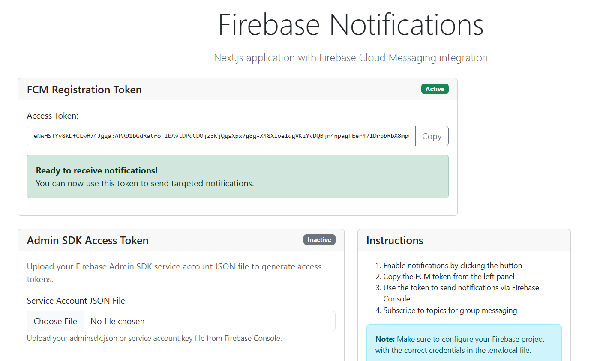

# Next.js Firebase Notifications App

A complete Next.js application with Firebase Cloud Messaging (FCM) integration for handling push notifications.



## Features

- 🔥 Firebase Cloud Messaging integration
- 🔔 Push notification handling (foreground & background)
- 📱 Topic subscription/unsubscription
- 🎨 React Bootstrap UI components
- 🔒 Environment variable configuration
- 📊 Token display and management

## Project Structure

```
nextjs-firebase-notifications/
├── components/
│   ├── NotificationHandler.tsx    # Handles incoming notifications
│   └── TopicSubscription.tsx      # Topic subscription component
├── hooks/
│   └── useFirebaseMessaging.ts    # Custom hook for FCM functionality
├── lib/
│   └── firebase.ts                # Firebase configuration
├── pages/
│   ├── api/
│   │   ├── subscribe-topic.ts     # API route for topic subscription
│   │   └── unsubscribe-topic.ts   # API route for topic unsubscription
│   ├── _app.tsx                   # App component with Bootstrap CSS
│   └── index.tsx                  # Main page
├── public/
│   └── firebase-messaging-sw.js   # Service worker for background messages
├── .env.local                     # Environment variables
├── next.config.js                 # Next.js configuration
└── package.json                   # Dependencies
```

## Setup Instructions

### 1. Install Dependencies

```bash
npm install
# or
yarn install
```

### 2. Firebase Project Setup

1. Go to [Firebase Console](https://console.firebase.google.com/)
2. Create a new project or select an existing one
3. Enable Cloud Messaging in your Firebase project
4. Go to Project Settings > General > Your apps
5. Add a web app and get your Firebase config
6. Go to Project Settings > Cloud Messaging
7. Generate a new key pair for Web Push certificates (VAPID key)

### 3. Environment Configuration

Create a `.env.local` file in the root directory and add your Firebase credentials:

```bash
# Firebase Configuration
NEXT_PUBLIC_FIREBASE_API_KEY=your_api_key_here
NEXT_PUBLIC_FIREBASE_AUTH_DOMAIN=your_project_id.firebaseapp.com
NEXT_PUBLIC_FIREBASE_PROJECT_ID=your_project_id
NEXT_PUBLIC_FIREBASE_STORAGE_BUCKET=your_project_id.appspot.com
NEXT_PUBLIC_FIREBASE_MESSAGING_SENDER_ID=your_sender_id
NEXT_PUBLIC_FIREBASE_APP_ID=your_app_id
NEXT_PUBLIC_FIREBASE_MEASUREMENT_ID=your_measurement_id

# Firebase Cloud Messaging
NEXT_PUBLIC_FIREBASE_VAPID_KEY=your_vapid_key_here

# Server Key (for topic subscription - get from Firebase Console > Project Settings > Cloud Messaging)
FIREBASE_SERVER_KEY=your_server_key_here
```

### 4. Update Service Worker

Update `public/firebase-messaging-sw.js` with your actual Firebase config:

```javascript
const firebaseConfig = {
  apiKey: "your_actual_api_key",
  authDomain: "your_actual_auth_domain",
  projectId: "your_actual_project_id",
  storageBucket: "your_actual_storage_bucket",
  messagingSenderId: "your_actual_sender_id",
  appId: "your_actual_app_id",
  measurementId: "your_actual_measurement_id"
};
```

### 5. Run the Application

```bash
npm run dev
# or
yarn dev
```

The app will be available at `http://localhost:3000`

## Usage

### Getting Started

1. Open the application in your browser
2. Click "Enable Notifications" to request permission
3. Copy the FCM token displayed on the page
4. Use this token to send notifications via Firebase Console or your backend

### Topic Subscription

1. Enter a topic name (e.g., "news", "sports", "weather")
2. Click "Subscribe" to subscribe to the topic
3. Click "Unsubscribe" to unsubscribe from the topic
4. Send notifications to topics via Firebase Console

### Sending Test Notifications

#### Via Firebase Console:
1. Go to Firebase Console > Cloud Messaging
2. Click "Create your first campaign" or "New campaign"
3. Choose "Firebase Notification messages"
4. Enter title and text
5. Send to a single device (use the token) or to a topic

#### Via REST API:
```bash
curl -X POST https://fcm.googleapis.com/fcm/send \
  -H "Authorization: key=YOUR_SERVER_KEY" \
  -H "Content-Type: application/json" \
  -d '{
    "to": "DEVICE_TOKEN_HERE",
    "notification": {
      "title": "Test Notification",
      "body": "This is a test message"
    },
    "data": {
      "custom_key": "custom_value"
    }
  }'
```

## Key Features Explained

### Notification Handling
- **Foreground**: Shows toast notifications when app is active
- **Background**: Handled by service worker, shows browser notifications
- **Data payload**: Additional data can be sent with notifications

### Topic Management
- Subscribe/unsubscribe to topics programmatically
- Send notifications to all users subscribed to a topic
- Useful for broadcasting messages to user segments

### Token Management
- Automatic token generation and refresh
- Token display for testing purposes
- Copy to clipboard functionality

## Troubleshooting

### Common Issues

1. **Notifications not working in development**
    - Make sure you're running on `https://` or `localhost`
    - Check browser notification permissions
    - Verify service worker registration

2. **Token not generating**
    - Check Firebase configuration
    - Ensure VAPID key is correct
    - Check browser console for errors

3. **Topic subscription failing**
    - Verify server key in environment variables
    - Check network requests in browser dev tools
    - Ensure Firebase project has Cloud Messaging enabled

### Browser Support
- Chrome 50+
- Firefox 44+
- Safari 16+ (macOS 13+)
- Edge 17+

## Development Notes

### Adding More Features

To extend this app, you might want to add:
- User authentication
- Notification history storage
- Advanced notification scheduling
- Analytics and tracking
- Custom notification sounds
- Rich notifications with images

### Security Considerations

- Never expose server keys in client-side code
- Validate all API requests on the server side
- Implement proper authentication for topic management
- Consider rate limiting for API endpoints

## Production Deployment

1. Set up environment variables in your hosting platform
2. Ensure HTTPS is enabled
3. Configure proper CSP headers
4. Test notifications across different browsers
5. Monitor FCM quotas and usage

## License

This project is open source and available under the [MIT License](LICENSE).